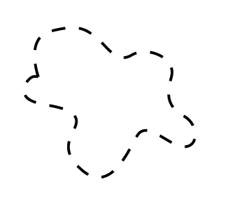

# Anime.js

#### [전체 README.md로 돌아가기](../../../포트폴리오/README.md)

### 개요


* HTML에 CDN 첨부하여 구현

### 목적
* About 부분 svg 애니메이션 첨부하기 위해 사용

### 스크립트
1. 텍스트 라인 애니메이션
    ```js
    let svgTextAnimation = anime({
        targets: '.svgText path',
        strokeDashoffset: {
            value: [anime.setDashoffset, 0],
            easing: 'easeInOutSine',
            duration: 3000,
            delay: function (el, i) {
                return i * 500
            },
        },
        opacity: {
            value: [0, 1],
            easing: 'easeInOutSine',
        },
        direction: 'alternate',
        loop: true
        });
    ```
    * target : svgText (Artistic Developer) 라인 텍스트
    * strokeDashoffset : 
      * 
      * 즉, svg가 도형을 표현하는 방법을 이용하는것인데. Dash의 길이와 유지시간을 이용해 텍스트가 그려지는듯한 표현을 하는것이다.
      * [이것에 대한 자세한 DOC은 Anime.js 도큐먼트에 언급되어있다.](https://css-tricks.com/svg-line-animation-works/)
        ```
        duration : ms 단위로 유지
        easing : 오토메이션 곡선
        ```
    * opacity : 0 ~ 1까지의 값을 사용해서 흐려지다가 보이는 효과를 표현하기위해 사용함
    * loop : loop 설정해서 지속적인 효과를 보이게 한다.

2. 타원 애니메이션
    ```js
    let ellipseListAnimation = anime({
        targets: '.EllipseList svg',
        translateY: {
            value: -30,
            easing: 'cubicBezier(.19,.14,0,1.1)',
            duration: 6000,
        },
        opacity: {
            value: [0, 1],
            duration: 6000,
            easing: 'easeInOutSine',
        },
        delay: anime.stagger(100), // increase delay by 100ms for each elements.
        direction: 'alternate',
        loop: true
    });
    ```
    * target : EllipseList 초록색 타원
    * translateY :
      * 아래에서 위로 슬며시 부상하는 애니메이션을 적용하기위한 값
    * opacity : 0 ~ 1까지의 값을 사용해서 흐려지다가 보이는 효과를 표현하기위해 사용함
    * delay : 도미노 처럼 순서를 정의해 타원 각각마다 순차적으로 부상하는 효과를 주기위해 설정한것.   