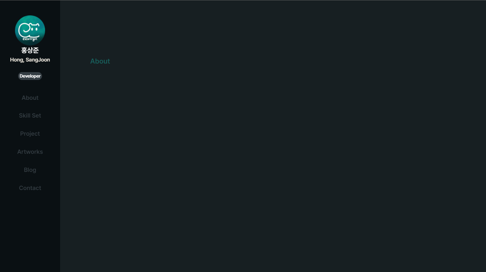
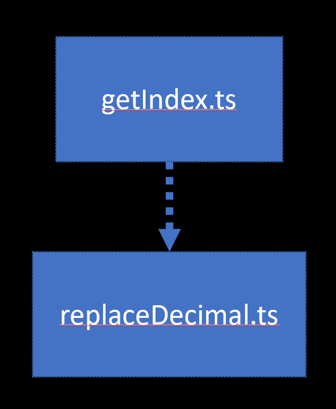

# getIndex 모듈
---
## 개요

* 

---

### 목적
* 현재 스크롤 바가 어디 Section에 위치하고 있는지를
정수형 인덱스값으로 내보내는데 사용하는 클래스 이다.

---

### 관계
* 의존 관계는 다음과 같다.


---

### 구성
* #### sectionIndex : Class
  * 멤버 변수
    ``` ts
        private mSectionSet : HTMLElement; /section 집합을가져옴/ 
        private mSectionSetElements : NodeListOf<HTMLElement>; /section 집합을 이루는 원소들/
        private mTempIndex : number; /section의 인덱스 번호 /
        private mOffset : number; /mSectionSetElements 간 넘어갈때 인식범위/
    ```
  * 매서드
    ```ts
        constructor(){...} /멤버변수 초기화/
        private calCurSection(): number{...} /현재 섹션위치를 계산하여 정수값을 반환/
        public DEBUG() : void{...} /생성자가 잘 작동 되었는지 디버깅하는 함수 (없어도 된다.) /
        public GetCurIndex() : number{}  /현재 섹션위치 접근/
    ```

* #### 세팅
  * export
    ```ts
    const sectionClass : sectionIndex = new sectionIndex();
    export {sectionClass};
    ```
  * import
    ```ts
    import sectionClass from ...;
    ```
---

### 스크립트
```ts
import replaceToDecimal from './replaceDecimal'

class sectionIndex {
    /*
        멤버변수
            mSectionSet : 사이드바 이외 우리가 음직이는것들
            mSectionSetElements : 우리가 움직이는것들 섹션들
            mTempIndex : 현재 위치한 섹션 인덱스
            mOffset : 스크롤 내렸을때 인식 범위
    */
    private mSectionSet : HTMLElement;
    private mSectionSetElements : NodeListOf<HTMLElement>;
    private mTempIndex : number;
    private mOffset : number;
    /*
        생성자
            멤버 변수 초기화
            생성자는 offset을 받아 초기화 해준다

        replaceToDecimal(window.getComputedStyle(this.mSectionSetElements[0]).getPropertyValue('margin'))[0];
            CSS string가져오기 -> 정수로 바꾸기

            이게 뭔가 싶은데 세단락으로 나눠보면
            ```
            1. replaceToDecimal( : string) : Array<number>
                1. 즉, CSS의 string 값을 읽어와
                2. CSS string을 split하고
                3. 정수값 배열로 반환하는 함수다.

            2. window.getComputedStyle(this.mSectionSetElements[0])
                .getPropertyValue('margin'))
                적용된 CSS string 값을 가져오는 역할을 한다. 
                    margin: 148px 80px 0; 을 가져온다
            
            3. [0]
                만약 margin: 148px 80px 0; 을 가져왔으면
                    [148, 80, 0] 으로 반환한다
                    거기서 우린 margin top을 알고싶으니 [0]을 가져온다.
            ```
    */
    constructor(){
        this.mSectionSet = document.querySelector("section.ContentSection") as HTMLElement;
        this.mSectionSetElements = this.mSectionSet.querySelectorAll("section") as NodeListOf<HTMLElement>;
        this.mTempIndex = this.calCurSection();

        this.mOffset = replaceToDecimal(window.getComputedStyle(this.mSectionSetElements[0]).getPropertyValue('margin'))[0];
    }
    /*
        calCurSection
            현재 스크롤 바에 따라서 어느 섹션에 있는지 리턴하는 매서드.
    */
    private calCurSection(): number {
        let curScrollY = window.pageYOffset;
        for (let i = 0; i < this.mSectionSetElements.length; i++) {
            const curSection = this.mSectionSetElements[i];
            let curSectionHeight = curSection.getBoundingClientRect().bottom + curScrollY;
            if (curScrollY <= curSectionHeight - this.mOffset) {
                this.mTempIndex = i;
                break;
            }
        }
        return this.mTempIndex;
    }
    /*
        디버깅 용으로 만든 메서드
            생성자에 따라 멤버 변수가 잘 정의되었는지 혹인
    */
    public DEBUG() : void{
        console.log(this.mSectionSet);
        console.log(this.mSectionSetElements);
        this.mSectionSetElements.forEach( _E=>{
            console.log(_E.getBoundingClientRect().bottom);
        })
        console.log(replaceToDecimal(window.getComputedStyle(this.mSectionSetElements[0]).getPropertyValue('margin'))[0]);
    }
    /*
        calCurSection
            접근가능한 매서드
    */
    public GetCurIndex() : number{
        return this.calCurSection();
    }
}

const sectionClass : sectionIndex = new sectionIndex();

export {sectionClass};
```
---

### 관계를 맺는 스크립트
* **[Doc : replaceDecimal](../doc_replaceDecimal%EB%AA%A8%EB%93%88/./replaceDecimal.md)**
