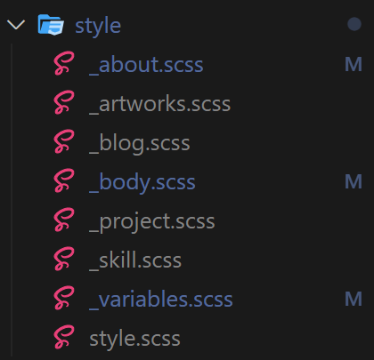

# SCSS

#### [전체 README.md로 돌아가기](../../../포트폴리오/README.md)



### 관계
관계는 다음과 같다.
1. style.scss는 웹팩 Entry파일이 된다.
2. _body.scss는 각 section의 SCSS 파일을 import해서
   * 미디어 쿼리 작성이 수월하게 만들었다
   * 어떻게 보면 실질적으로 Main에 해당하는 파일이다
3. _variable.scss
   * 모든 section에서 의존중인 파일이다
   * 변수와 Mixin을 포함시켜 재사용성을 높이기 위해 작성했다.

### 웹팩 js 설정
```js

module.exports = {
    /*
    devtool: 'eval-source-map',
    //엔트리와 output을 명시한다.
    //https://stackoverflow.com/questions/42813050/webpack-multiple-entry-points-sass-and-js
    */
    entry: ['./src/index.ts', './style/style.scss'],
    module: {
        //test는 로더를 적용할 파일 형식으로 일반적으로 정규 표현식 사용한다. 
        /*
        rules: [{
                test: /\.ts$/,
                use: 'ts-loader',
                include: [path.resolve(__dirname, 'src')] //타겟 대상은 어디에 있는가..
            },
            */
            {
                test: /\.scss$/,
                use: [MiniCssExtractPlugin.loader,'css-loader', 'sass-loader'],
                include: [path.resolve(__dirname, 'style')]
            },
            /*
            {
                test: /\.(png|jpg|gif)$/i,
                loader: 'file-loader',
                options:{
                    name : 'public[contenthash].[ext]',
                }
            },
            */
        ]
    },
    /*
    resolve: {
        extensions: ['.ts', '.js']
    },
    output: {
        publicPath: 'public',
        filename: 'bundle.js',
        path: path.resolve(__dirname, 'public')
    },
    */
    plugins: [
        new MiniCssExtractPlugin({ filename: 'style.css' })
    ]
}
```